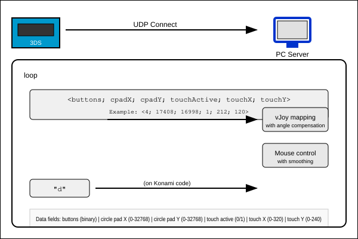

# 3DS vJoy Controller
This project allows anybody with one (or more) 3DS and vJoy to use their device(s) as a singular, coherent controller.
When a 3DS joins the server (running on the system where the button inputs are wanted), it will be assigned the next available buttons and axes on the virtual controller and update those depending on which buttons are pressed on the 3DS. This version offers faster fire-and-forget UDP connection while offering support for a wider array of inputs, including a rudimentary mouse using the touchscreen and L and R buttons, and a konami code to exit the application without removing ability to use the start button as a controller input. 

Maps all 3DS buttons to vJoy virtual joystick buttons
Circle pad controls mapped to vJoy X/Y axes with angle compensation
Touchscreen controls mouse movement
L/R buttons control mouse clicks when touchscreen is active
Optimized for low latency with UDP communication
Support for multiple client connections
Performance statistics display

Focus of the project is the simple protocol and the extensibility for different devices. Number of buttons and axes can be dynamic, depending on which device class is preferred.

Also the OS-native input-methods of the 3DS were used for the 3DS implementation of the protocol. Fixed long delay between inputs with svcsleep, minimized data sent by stringifying outputs to be parsed with a regex, as well as only sending inputs when input is changed or held. 

For educational purposes only.
# Requirements
- Nintendo 3DS
  - with the spicy firmware Nintendo loves
- [vJoy](https://github.com/shauleiz/vJoy)
- Python
  - `pyvjoy`-Library
## Build-Requirements
- [devkitARM](https://devkitpro.org/wiki/Getting_Started)
# Getting the 3DS application

## From Releases
Go over to the releases and download the binary

## By building yourself
`cd 3ds && make`

## From Universal Updater
> [!NOTE]  
> The app is submited to Universal DB to be available in the Universal Updater
> Still in revision

# Usage
1. Install the `.3dsx` app to your 3DS devices
2. Start the server using `python3 server.py`
3. Start the application on your 3DS devices
4. Enter the IP of the server
5. Profit

# Protocol


## Data
The data is sent in the following format:
```
<Packet>  ::= '<' <Data> '>'
<Data>    ::= <Integer> ';' <Data> | <Integer>
<Integer> ::= <Digit> | <Digit> <Integer>
<Digit>   ::= '0' | '1' | '2' | '3' | '4' | '5' | '6' | '7' | '8' | '9'
```

## Example
```plaintext
<4; 17408; 16998; 1; 212; 300>
```
<buttons; cpad x; cpad y; touch active?; touch x; touch y>
- First integer will be interpreted as pressed buttons binary formatted
  - 4 = 00000000100
    - 0 = A
    - 0 = B
    - 0 = X
    - 1 = Y
    - 0 = dpad up
    - 0 = dpad down
    - 0 = dpad left
    - 0 = dpad right
    - 0 = L
    - 0 = R
    - 0 = select
    - 0 = start
- Second integer will be interpreted as the X-Axis value
  - The value is in the range of 0-32768
- Third integer will be interpreted as the Y-Axis value
  - The value is in the range of 0-32768

- There are multiple versions of the servers I made and kept, the two most recent are "server" and "server axis amplitude corrected". the amplitude corrected version corrects for the difference between the circle pad's circular range and the square input expected by many games.

-Configuration
  -Configure these settings in the server script:

    -mouse_smoothing: Mouse movement smoothing (0-1)
    -mouse_update_interval: Mouse update rate in seconds
    -touch_scale_factor: Touch screen scaling
    -debug_mode: Enable/disable debug output
    -display_stats: Enable/disable performance statistics